# prisma samples

Small programs that each show one thing the [prisma](https://github.com/akadjoker/prisma) driver can do. They run on OpenGL 4.6, OpenGL ES 3 and Vulkan: add `vulkan` to the command line for Vulkan, a number to stop after that many frames, and `still` to freeze time.

The demos that load meshes and textures read them from a media folder: set the environment variable `PRISMA_MEDIA` or the CMake option `PRISMA_MEDIA_DIR`. A demo whose feature is missing on the GPU prints a line and exits.

| | | |
|---|---|---|
|  **01 clear**<br>a window cleared to one colour |  **02 triangle**<br>one coloured triangle | 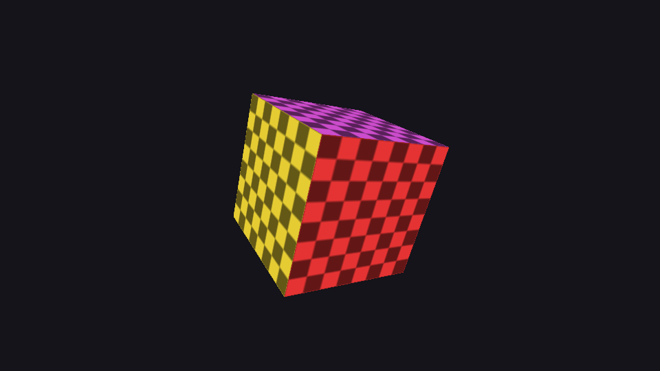 **03 cube**<br>a textured cube; `offscreen` draws it to an HDR target first |
| 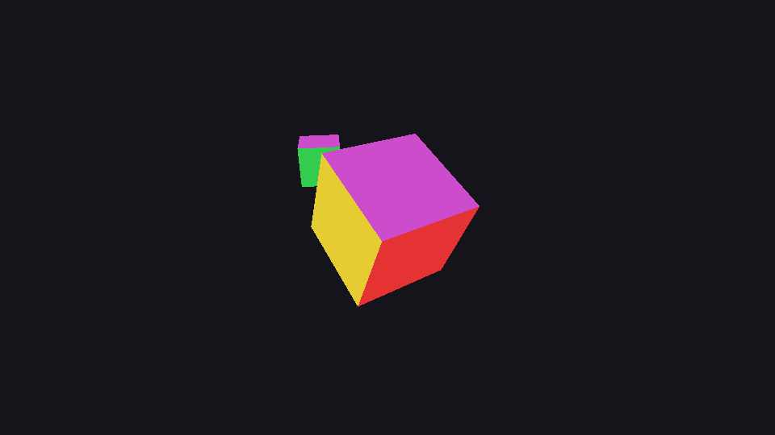 **04 two cubes**<br>depth testing and several draws sharing one uniform buffer | 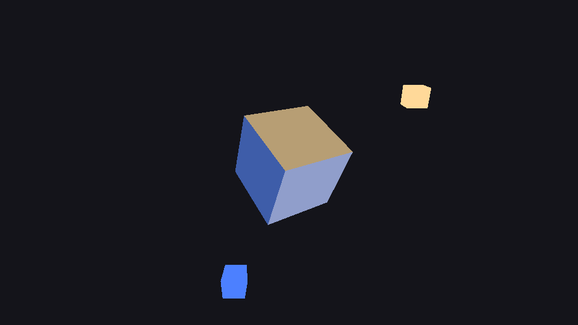 **05 lighting**<br>two directional lights |  **06 texture**<br>a compressed texture with its mip chain and anisotropic filtering |
| 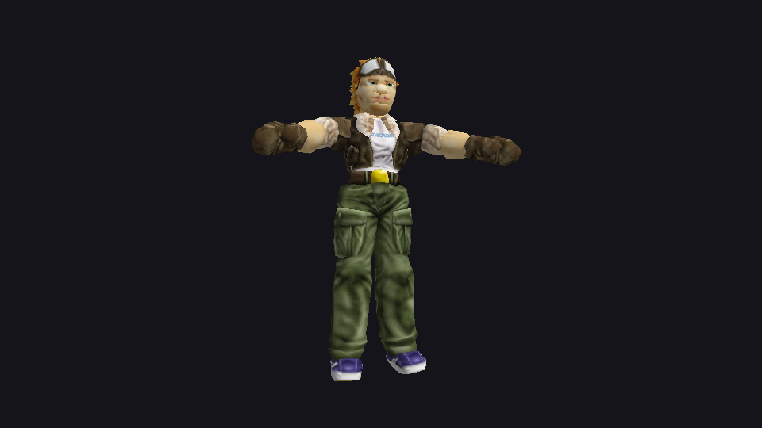 **07 model**<br>a mesh file with materials and textures |  **08 reflection**<br>cube map reflection | 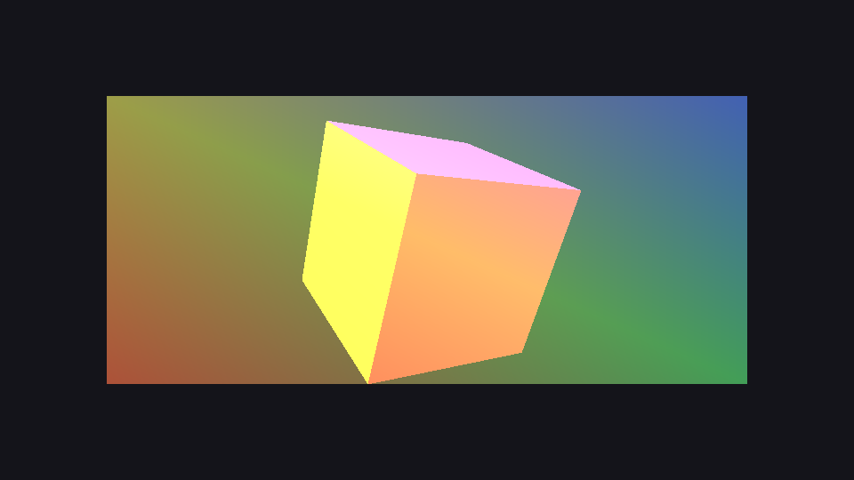 **09 blend and stencil**<br>blend modes and stencil masks (keys 1 to 4 and S) |
|  **10 instancing**<br>4000 cubes in one draw call |  **11 offscreen msaa**<br>a multisampled offscreen target with resolve |  **12 particles**<br>16384 particles simulated by a compute shader |
| 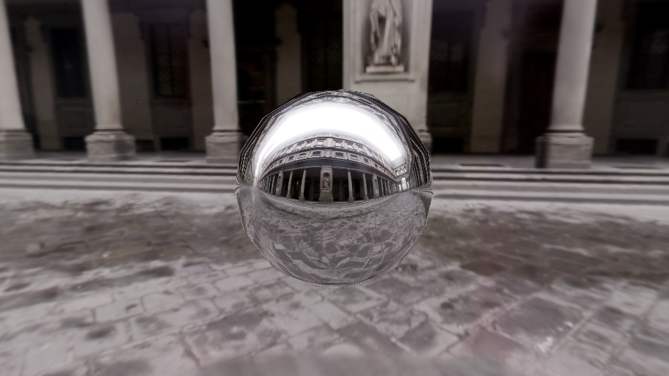 **13 hdr**<br>HDR scene, bloom and tone mapping (up and down, B) | 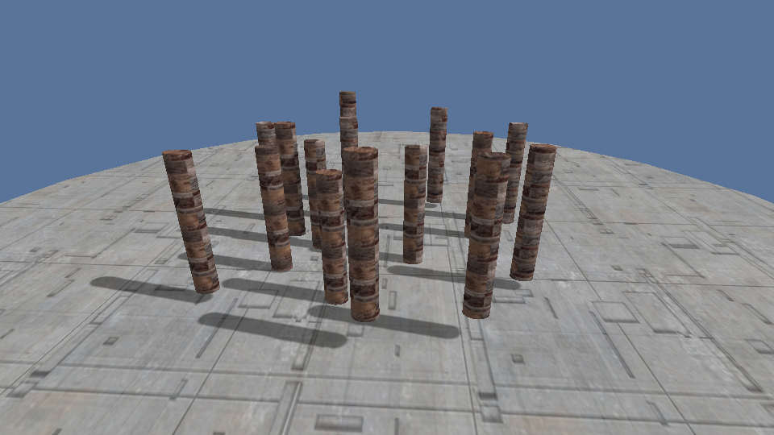 **14 shadow map**<br>shadow mapping with a comparison sampler |  **15 soldier**<br>animated skinned characters |
| 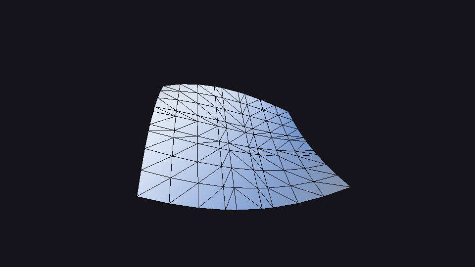 **16 tessellation**<br>a Bezier surface on the tessellator (up and down, W) |  **17 point sprites**<br>a geometry shader turns points into quads | 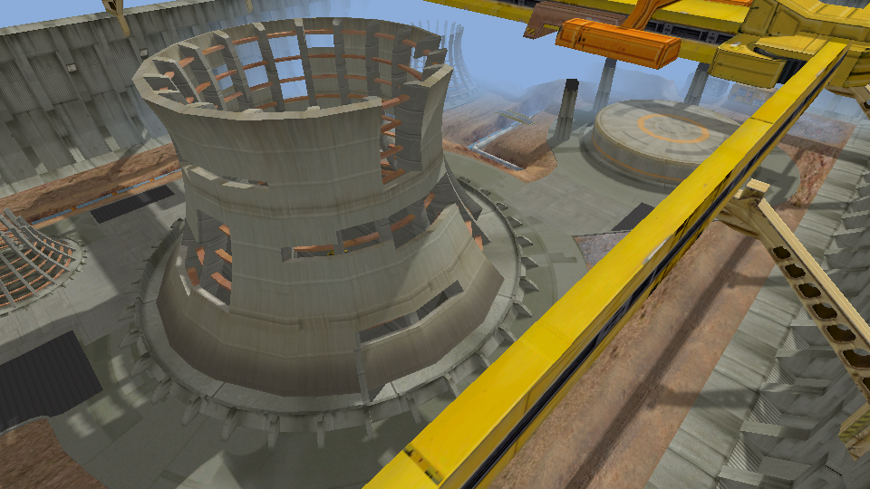 **18 cascaded shadows**<br>four shadow cascades over a power plant (C tints the cascades, T switches scene) |
|  **19 variance shadows**<br>blurred depth moments and Chebyshev shadows (up and down change the blur) | 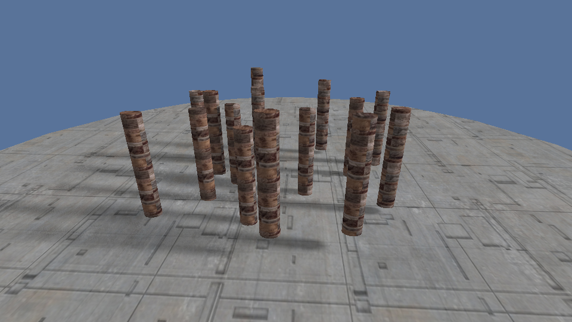 **20 contact hardening**<br>soft shadows that widen with distance from the caster (up and down change the light size) | 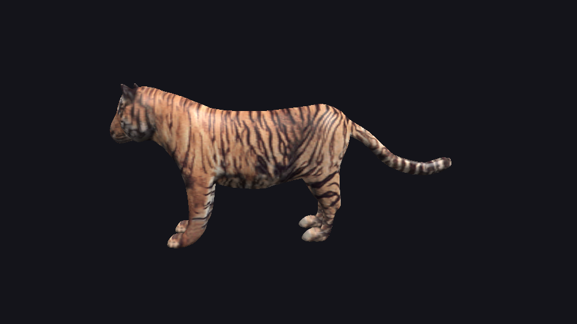 **21 pn triangles**<br>curved PN triangles on the tessellator (up and down, W, P) |
| 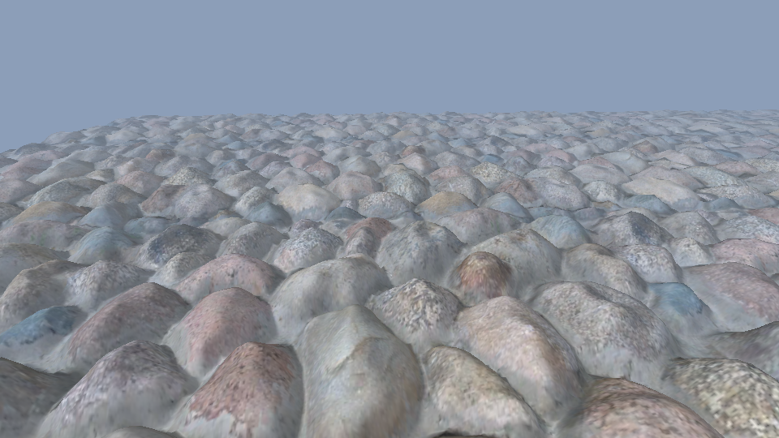 **22 displacement**<br>displacement mapping with crack-free tessellation levels (up and down, W) |  **23 fluid**<br>a 2D smoothed-particle hydrodynamics fluid in compute shaders |  **24 n-body**<br>8192 bodies attracting each other, shared-memory tiles in compute |
| 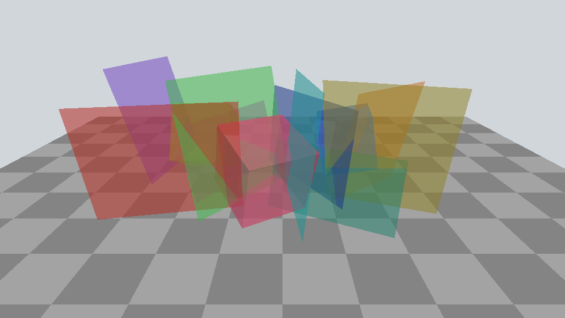 **25 oit**<br>order-independent transparency with per-pixel linked lists (O toggles) |  **26 basic compute**<br>a compute shader adds two buffers, the result is read back and checked on the CPU, then drawn as a grid |  **27 compute sort**<br>bitonic sort of 65536 values in shared memory, one dispatch per step, checked against the CPU sort |
| 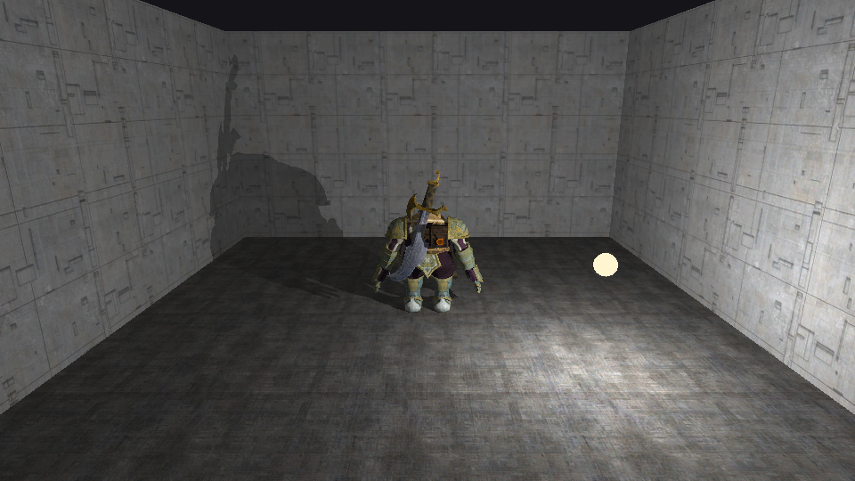 **28 shadow volume**<br>stencil shadow volumes: silhouette edges extruded away from an orbiting light in the vertex shader, counted with a two-sided depth-fail stencil (T shows the volume) | 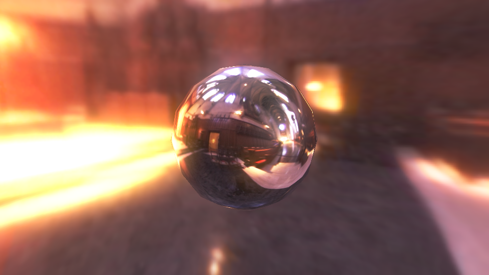 **29 hdr tonemap compute**<br>HDR scene with auto exposure in compute shaders: log-luminance reduction in shared memory, time-based adaptation kept on the GPU, bright pass and separable blur into storage images, then a tone-mapping pass (L cycles the scene brightness, B toggles bloom; `dark` and `bright` start at that level) | 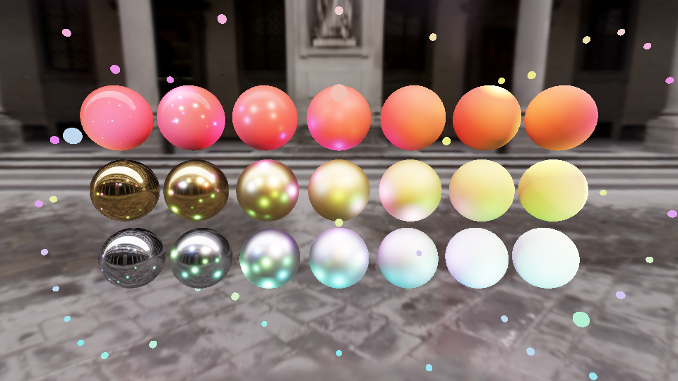 **30 pbr ibl**<br>physically based spheres lit by an environment probe (SH irradiance, GPU-prefiltered specular, BRDF table) and by a sun, point lights, a spot and 48 small lights culled into a froxel grid (L toggles the lights; `grace`, `stpeters`, `galileo` and `rnl` pick another probe) | 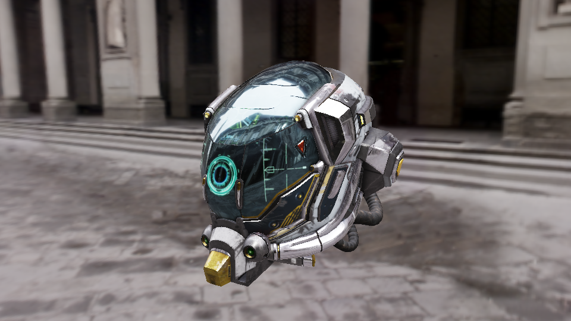 **31 gltf viewer**<br>glTF 2.0 viewer on the PBR shaders: metal-roughness and specular-glossiness materials, normal, occlusion and emissive maps, alpha modes, culling and sorting (`model=path` opens another file) |
| 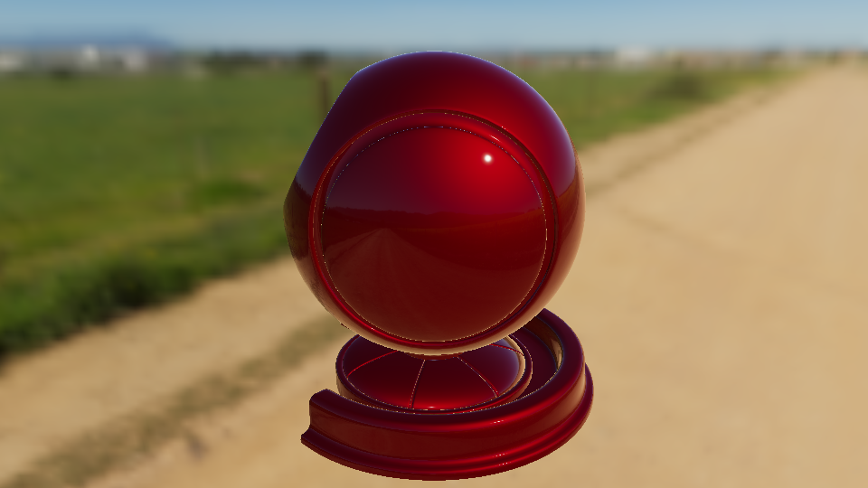 **32 ibl clear coat**<br>the shader ball with a clear coat over a metallic red base, lit by an equirectangular HDR (`env=file.hdr`) and a 110000 lux sun, exposed at f/16, 1/125 s, ISO 100 (`blur=` sets how blurred the background is, `model=` loads another OBJ or glTF path) | | |
| 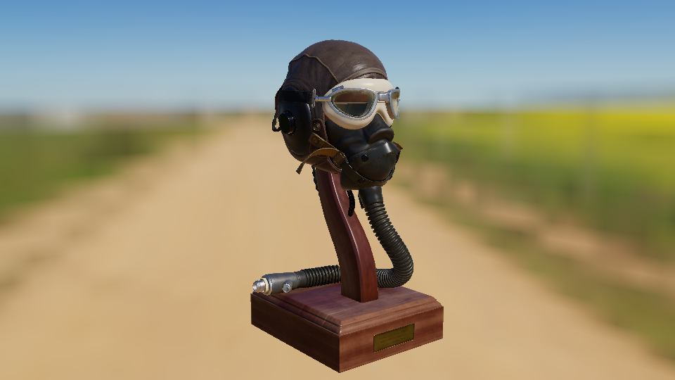 **33 flight helmet**<br>the FlightHelmet glTF (leather, rubber, wood, metal and glass with colour, normal and occlusion-roughness-metal maps, the lenses blended) lit by the equirectangular HDR of a flower road without its sun, a 110000 lux sun that follows the camera and the f/16 exposure of demo 32; the model has to be converted first with `gltf_undraco` (`model=path.gltf`, default `models/FlightHelmet/FlightHelmet.gltf`), `env=` picks the HDR, `blur=` the background blur, `yaw=` the start angle of the camera, `turn=` the turn of the model and `ev=` stops of exposure added | | |
| 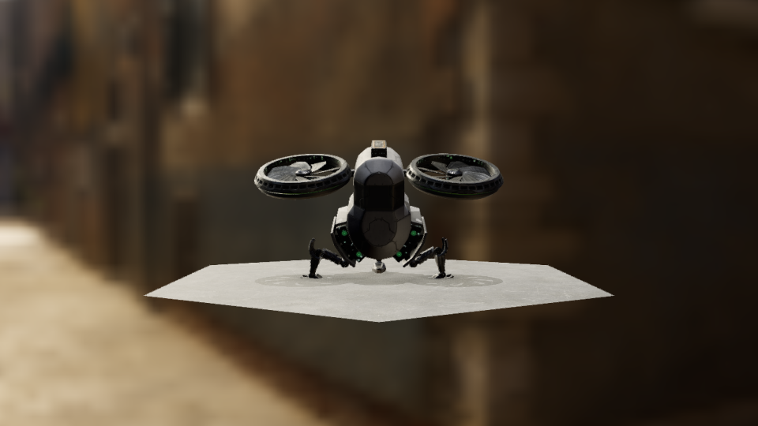 **34 drone**<br>the Buster drone glTF (converted without Draco with `gltf_undraco`) lit by the Venetian crossroads HDR (`env=file.hdr`) and a 100000 lux sun straight above, drawn into a 1280x720 HDR target that never changes size and shown on the window through a full screen pass with the ACES legacy tone mapper, with the bloom of the reference (a thresholded downsample chain of six levels added back with `bloom=` strength, 0.10 by default, 0 turns it off), the shadow of the sun (an orthographic map fitted to the model, `shadowsize=` 2048 by default, `normalbias=`) screen space ambient occlusion (`ssao=0` turns it off, `aodebug` shows the occlusion term), FXAA on the tone mapped picture (`fxaa=0` turns it off) and so resizing the window only stretches the quad (`model=`, `blur=`, `yaw=`, `height=`, `ev=`) | | |
| 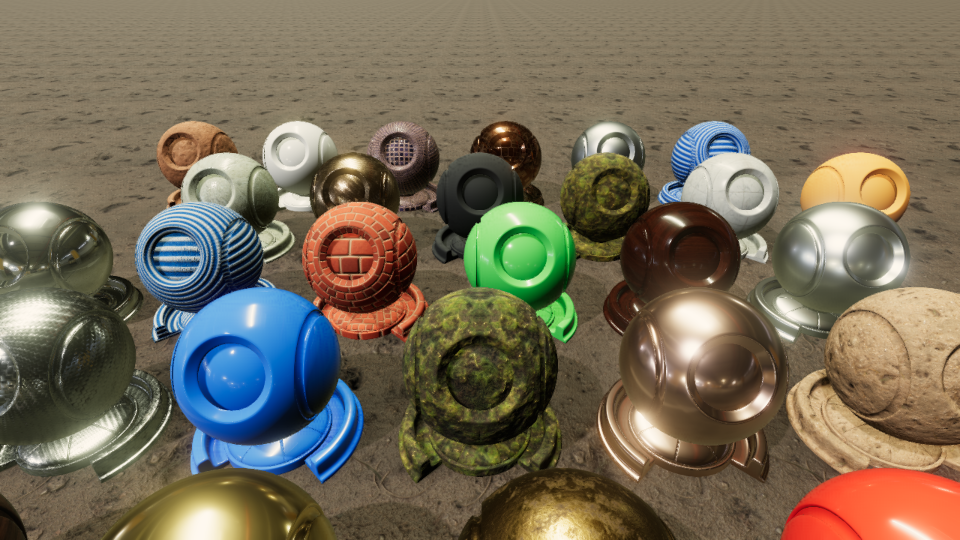 **35 materials**<br>thirty shader balls (the OBJ ball of the reference assets) with PBR materials on a gravel floor in a parking garage HDR, lit by the image based light and a sun with its shadow, with ambient occlusion, bloom and FXAA: eight texture sets of 2048 pixels (colour, normal, occlusion, roughness and metallic maps, reduced and packed into two textures each), marble and brick maps, and plastics and metals made of parameters only; the camera sways slowly (`swing=`, `height=`, `distance=`, `sun=` the strength of the sun, `shadowsize=`, `ssao=0`, `aodebug`, `bloom=`, `fxaa=0`, `ev=`, `blur=`, `env=`, `texdiv=` the divisor of the texture size, `extra=` the folder of the marble and brick maps) | | |
| 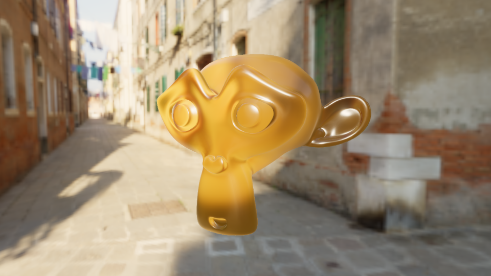 **36 refraction**<br>a Suzanne of amber glass with screen space refraction: the sky is drawn into a colour buffer, a Gaussian pyramid of seven levels is built from it (a separable filter of 21 taps) and the glass samples that pyramid at the refracted point, at a level that depends on its roughness, tinted by the absorption along the path through the thickness of the solid, with the Fresnel reflection of the image based light on top (`ior=`, `thickness=`, `roughness=`, `transmission=`, `absorbr=`, `absorbg=`, `absorbb=`, `yaw=`, `distance=`, `ev=`, `blur=`, `env=`, `model=`) | | |
| 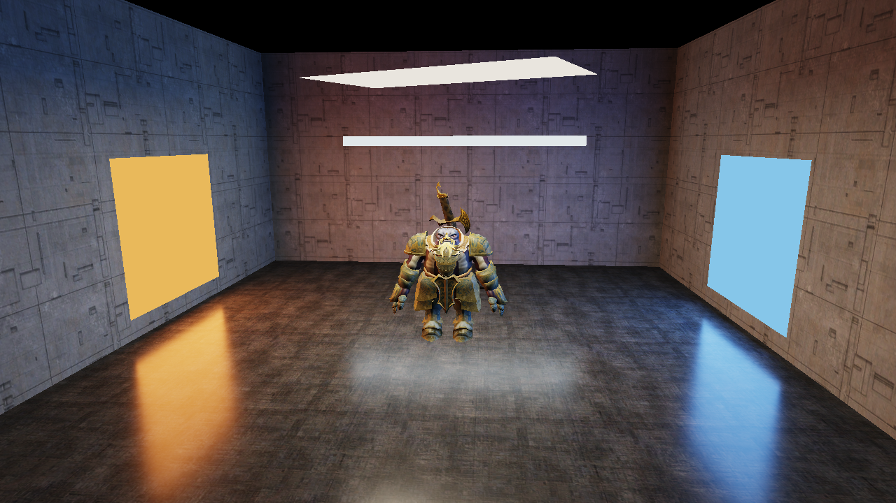 **37 area lights**<br>rectangle lights with linearly transformed cosines (Heitz, Dupuy, Hill and Neubelt, SIGGRAPH 2016): the dwarf in a room lit by four rectangles, a warm panel above that turns, an orange and a blue one on the side walls and a thin strip on the back wall, with no shadows; the GGX lobe is a clamped cosine under a matrix read from a 64x64 table, so diffuse and specular are the integral of that cosine over the clipped polygon, in closed form, and the glossy floor shows the exact shape of every light, blurred with the roughness. The shader is checked against a numerical integration over the quad in tests (`floor=` the roughness of the floor, up and down change it, `dwarf=`, `intensity=`, `exposure=`, `ambient=`, `turn=`, `twosided` makes the lights shine on both sides, keys 1 to 4 switch the lights) | | |
| 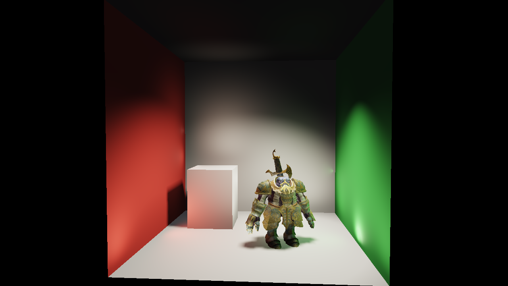 **38 instant radiosity**<br>one bounce of indirect light in a box with a red and a green wall, a box and the dwarf, lit by a spot light under the ceiling that swings over the room: the room is drawn from the light into a reflective shadow map (position, normal and colour of what the light sees, next to its depth, which also shades the direct light), a compute shader takes Hammersley samples of it and turns each into a virtual point light with the power the surface reflects (intensity, solid angle of the sample and albedo), and the lights go into the froxel grid of the clustered shading as spot lights along their normals, with a floor under the distance so the surface next to a light is no bright spot; the red wall paints the box and the green one the floor and the shadow of the dwarf. The froxels hold 16384 light records, so the ranges of the virtual lights shrink until the lists fit (`vpls=` the number of samples, 96 by default and 224 at most, `indirect=` and `direct=` scale the two lights, `intensity=`, `exposure=`, `ambient=`, `cull=` the contribution at the edge of the range of a light, `noindirect`, keys I toggles the indirect light and V shows the virtual lights as balls, `markers`) | | |
| 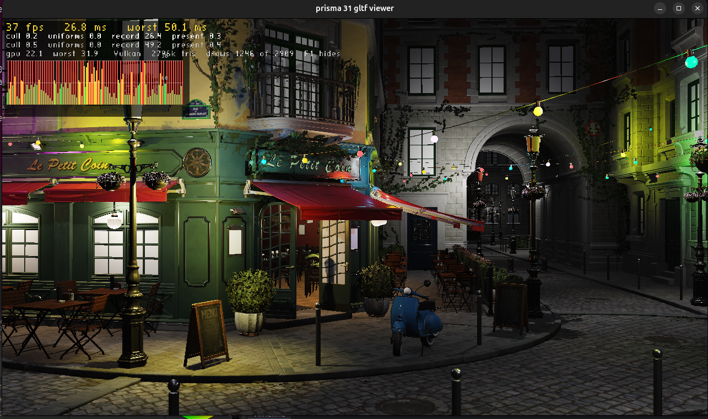 **bistro**<br>the exterior of the Amazon Lumberyard Bistro in the glTF viewer of demo 31, on Vulkan: 1.7 million vertices, 254 materials, 343 textures and 97 lights culled into the froxel grid, with shadow maps for the 32 lights nearest to the camera (`build/gltf_viewer vulkan camera model=path/bistro.gltf skipmips=2 lightscale=0.08 sunscale=0 ibl=0.03 sky=0.04`; `shadowdistance=`, 30 m by default and 0 for no limit, `shadowsize=`, 256 by default, `shadows=` the number of lights with a shadow) | | |

## Building

The project depends on [prisma](https://github.com/akadjoker/prisma), [zen_plataform](https://github.com/akadjoker/zen_plataform) and [math](https://github.com/akadjoker/math), all as submodules.

```sh
git clone --recursive https://github.com/akadjoker/prisma-samples
cd prisma-samples
cmake -S . -B build -DPRISMA_MEDIA_DIR=/path/to/Media -DPRISMA_MODELS_DIR=/path/to/models
cmake --build build
ctest --test-dir build
```

`glslangValidator` (or `glslang`) must be installed; SPIRV-Cross is built from prisma's submodule when `spirv-cross` is not on the path. `SAMPLES_BUILD_TESTS=OFF` skips the tests of the shared code. The demos are written to `build/<name>`.

## In the browser

`./web.sh` builds the demos of `web_demos.txt` with Emscripten for WebGL 2 and copies each to `web-out/<name>/` (`.html`, `.js`, `.wasm` and `.data`). It needs the Emscripten SDK on the path (`source emsdk_env.sh`), glslangValidator, a native build of the project (the shader tool spirv-cross is taken from its build folder) and the media folder. The files a demo reads are listed in its `web_media.txt` and packed with the page; the demo loop is suspended once per frame with Asyncify until the next animation frame of the browser. WebGL 2 has no compute, tessellation or geometry shaders, so the demos that need them (12, 16, 17, 21 to 27, 29, 38) only print a line and stop. Ten demos run today: 01, 02, 03, 04, 05, 09, 10, 11, 28 and 37.

## Running every demo

`./run_all.sh [build-dir] [frames] [backend]` configures the build directory if it does not exist, builds everything and runs each demo for the given number of frames (default 120, backend `vulkan` or empty for OpenGL); it prints a summary and exits with an error if any demo failed. Pointed at the windowless build described below it runs without opening any window.

## Screenshots without a window

The pictures above are taken by the demos themselves, with no window system: configure a tree whose window library is a stub and whose driver draws into an off-screen surface on the real GPU, then run the script.

```sh
cmake -S . -B build-shots -DSAMPLES_HEADLESS=ON -DSAMPLES_BUILD_TESTS=OFF
cmake --build build-shots
./shots.sh build-shots images
```

Any demo also saves a picture of the frame it is drawing when `PRISMA_SHOT=file.png` is set (and `PRISMA_SHOT_FRAME=n` picks the frame), in a normal window build too.
