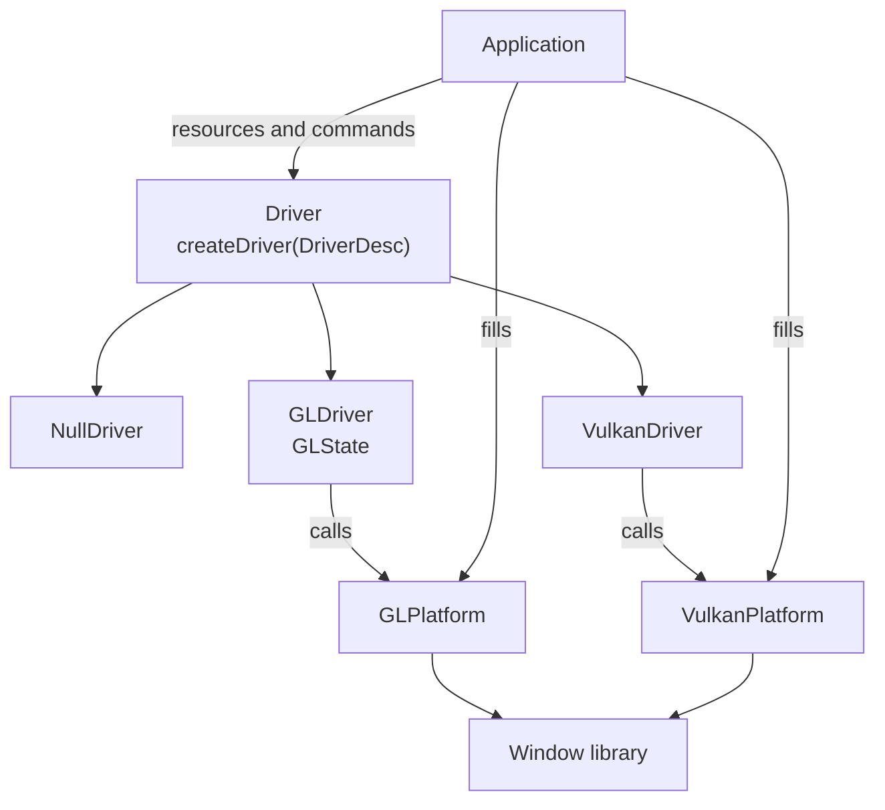

# prisma

A rendering backend library in C++14. It gives one interface over OpenGL 4.6, OpenGL ES 3 and Vulkan, and the backend is picked in code when the driver is created. It is the base for a renderer aimed at modern lighting and materials that still runs well on integrated GPUs.

## Features

- One `Driver` interface for every backend.
- Buffers (vertex, index, uniform, storage, indirect), textures (2D, 2D array, cube, cube array, 3D), samplers with anisotropic filtering and depth comparison, shaders and pipelines, all referenced by 32-bit handles.
- Compressed textures (BC1-7, ETC2/EAC, ASTC), partial texture updates, copies between textures and between buffers.
- Several vertex buffers per pipeline, compact vertex formats and instancing.
- Pipelines carry depth, stencil, cull, blend, colour mask and depth bias state.
- Render passes with load and store operations, drawing to the window or to offscreen targets: several colour targets, depth, HDR and sRGB formats, any mip level or layer of a texture.
- Multisampled render targets resolved at the end of the pass.
- Geometry shaders, adjacency topologies and tessellation (control and evaluation shaders, patch topology) where the GPU has them (`Caps::geometryShaders`, `Caps::tessellation`; not on WebGL or OpenGL ES before 3.2).
- Compute pipelines, storage buffers and storage textures, indirect draws and indirect dispatch.
- Occlusion queries and GPU time queries whose results never block.
- Shaders written once: the build turns each one into SPIR-V, GLSL 4.60 and GLSL ES, together with the list of resources it binds.
- Readback of pixels (window or texture) and of buffers (for example what a compute shader wrote), blocking or collected a frame later without waiting.
- Several windows drawn by one driver.
- Viewport and scissor with a top-left origin.
- The same conventions on every backend: clip depth from 0 to 1, linear colour with sRGB encoding on sRGB targets.
- Driver debug messages delivered to the application's log function.
- No window library inside the library: the application passes a few platform functions in a small struct.
- No exceptions, no RTTI and no standard containers.

## Backends

| Backend | Platforms | State |
|---|---|---|
| OpenGL 4.6 | desktop | working |
| OpenGL ES 3 | Android, web, desktop | working on desktop; Android and web not tested yet |
| Vulkan 1.3 | desktop, Android | working on desktop; Android not tested yet |
| Null | any | working; used by tests that need no GPU |

Only core features of each API are required. Extensions are optional and reported through `Caps`.

The same test, with checks made by reading pixels back, runs on OpenGL 4.6, OpenGL ES 3 and Vulkan. It runs without a window: OpenGL uses an EGL pixel buffer and Vulkan a headless surface, so `ctest` never opens anything on screen (`-DPRISMA_WINDOW_TESTS=ON` adds the same tests in a real window).

## Build

Requires CMake 3.21, a C++14 compiler and the OpenGL development files. The Vulkan backend is built when the Vulkan SDK is found.

The GPU tests also need `glslangValidator` (it comes with the Vulkan SDK and with the `glslang-tools` package) to compile their shaders. `spirv-cross` is taken from the system when installed and built from the submodule otherwise. The library itself needs neither.

```sh
git clone --recursive https://github.com/akadjoker/prisma.git
cd prisma
cmake -S . -B build
cmake --build build
ctest --test-dir build
```

| Option | Default | Meaning |
|---|---|---|
| `PRISMA_OPENGL` | `ON` | Build the OpenGL backend |
| `PRISMA_GLES` | `OFF` | Build the OpenGL backend for OpenGL ES 3 instead of OpenGL 4.6 |
| `PRISMA_VULKAN` | `ON` when Vulkan is found | Build the Vulkan backend |
| `PRISMA_BUILD_TESTS` | `ON` | Build the tests |

## Shaders

A shader is written once, in GLSL for Vulkan (`#version 450`). Uniform blocks use set 0, textures set 1, storage buffers set 2 and storage textures set 3, and the binding number is the slot the application binds to.

```cmake
include(cmake/PrismaShaders.cmake)
prisma_shaders(my_target shaders/mesh.vert shaders/mesh.frag)
```

Each file becomes a header with a `prisma::ShaderBlob` named after the file (`mesh_vert`, `mesh_frag`):

```cpp
#include "mesh.vert.h"

prisma::ShaderHandle shader = driver->createShader(prisma::shaderDesc(mesh_vert, driver->caps()));
```

## Demos

The demos live in [prisma-samples](https://github.com/akadjoker/prisma-samples), which uses this repository as a submodule; it has the pictures and the instructions for each one.

## Layout

```text
libprisma/include/prisma/rhi/   public headers: Driver.h, Types.h, Caps.h
libprisma/src/prisma/rhi/       backends: gl/, vulkan/, null/
tests/                          tests
external/                       submodules
```

## Architecture



The library never calls the window library. The application fills `GLPlatform` or `VulkanPlatform` with functions from whatever it uses to open windows.

## Dependencies

| Submodule | Used by |
|---|---|
| `external/containers` | the library |
| `external/zen_plataform` | the tests (window and input) |
| `external/SPIRV-Cross` | the build only: turns SPIR-V into GLSL for the tests and for the shaders of projects that use prisma (Apache-2.0) |

## License

MIT. See [LICENSE](LICENSE).
